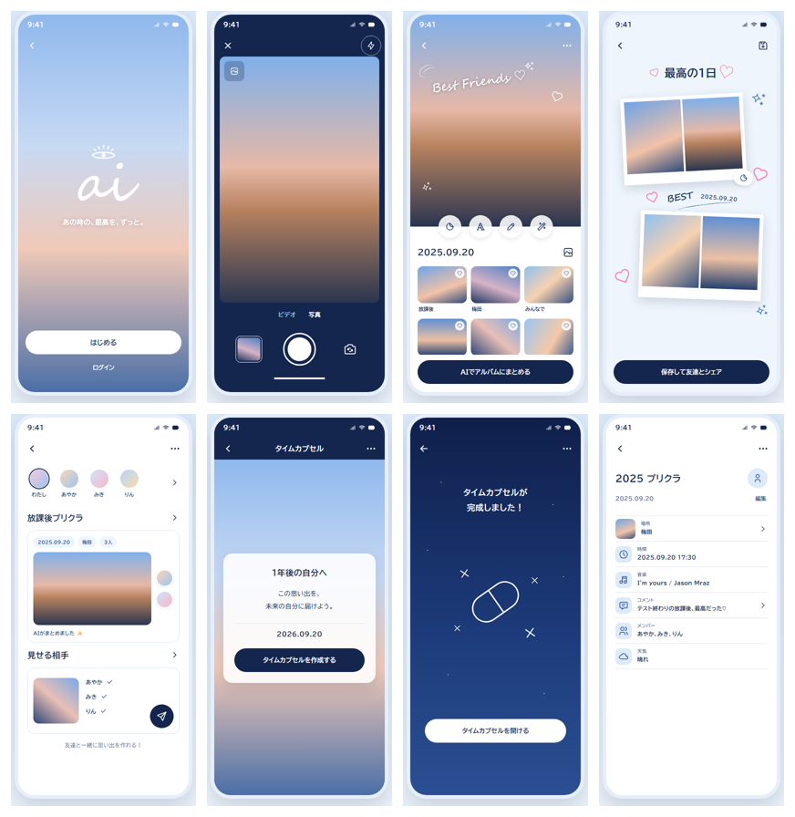
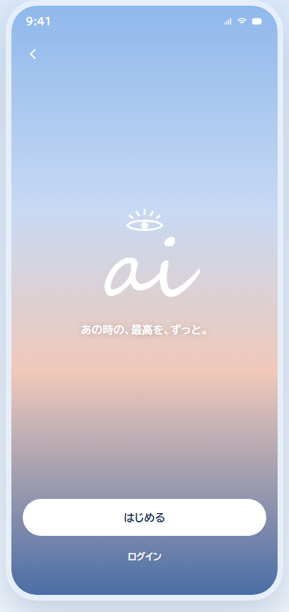
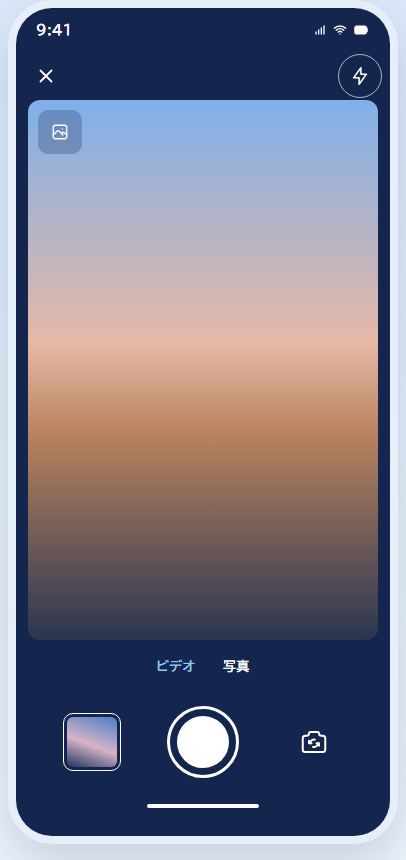
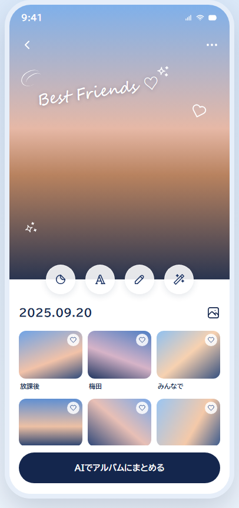
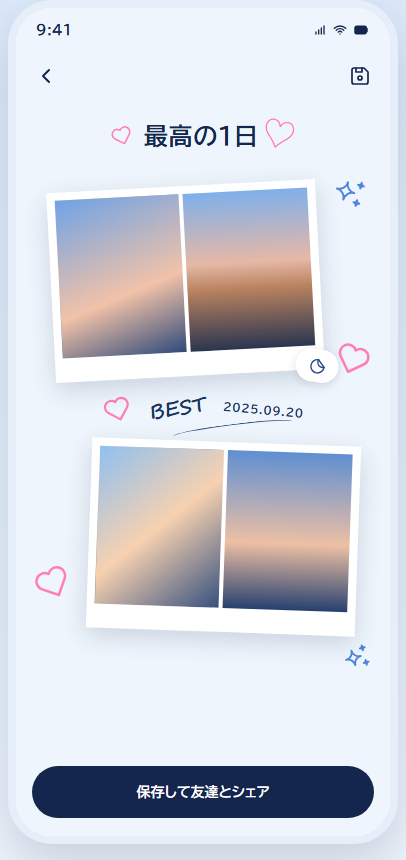
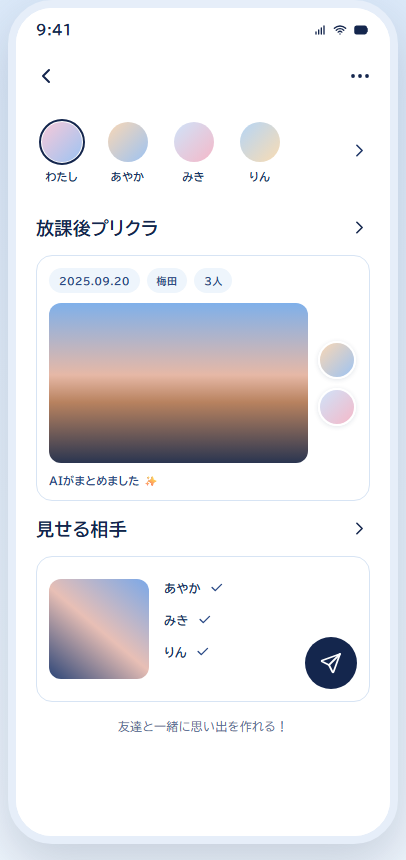
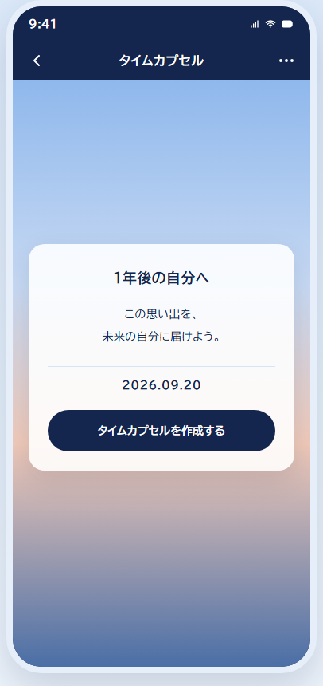
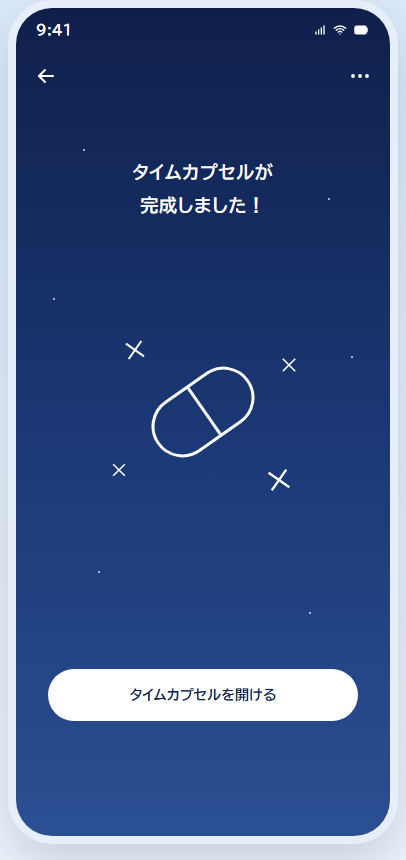
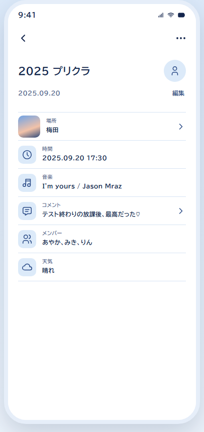

# Hanamizuki AI Hackathon

2026-09-26 10:45 → 2026-09-27 19:00
Theme: **Do something with AI!** ("AI" is read as *ai* in Japanese, which also means love, eye, I, indigo, ...) — solve a problem from your work or daily life this week.

Minutes, ideas and tasks are shared on Notion: <https://app.notion.com/p/Hanamizuki-AI-3e1e010f376b805c8e4cf151a6772546>

## Layout

```
frontend/   React + TypeScript (Vite)          http://localhost:5173
backend/    Spring Boot 4.1 / Java 21 (Maven)  http://localhost:8080
```

Requests from the frontend to `/api/*` are forwarded to the backend by the Vite dev proxy, so no CORS setup is needed.
Smoke test for the backend: `GET http://localhost:8080/api/hello`.

## Prerequisites

- Node.js 22+
- JDK 21+ (Maven is not required; use the bundled `mvnw`)

## Run (two terminals)

backend:

```
cd backend
./mvnw spring-boot:run        # Windows: mvnw.cmd spring-boot:run
```

frontend:

```
cd frontend
npm install
npm run dev
```

Open <http://localhost:5173>.

## UI mock (current state)

Single-theme React mock of the 8 screens on the presentation poster (`image-1.png`, see `DESIGN.md`).
Screens are wired in the poster's flow order; tapping the primary action moves to the next screen.
Photos, the "ai" logo lettering and the capsule illustration are gradient placeholders until generated images land
(swap them in `frontend/src/assets/index.ts`). Illegible poster text is inferred and tagged in `frontend/MOCK_SPEC.md`.



| Route | Screen | Preview |
|---|---|---|
| `/` | Home |  |
| `/camera` | Camera |  |
| `/album/new` | Album create |  |
| `/album/decorate` | Decorate |  |
| `/album/share` | Share |  |
| `/capsule/new` | Time capsule create |  |
| `/capsule/done` | Time capsule done |  |
| `/album/detail` | Album detail |  |

Screenshots are taken from `npm run build` output at 390×844 (headless Chrome). Regenerate them when a screen changes.

## Workflow

- One branch per feature, merged into `main` via pull request
- Language: English for code, comments, commit messages and docs
- Add API endpoints as controllers under `backend/src/main/java/com/hanamizuki/backend/api/`
- Add screens under `frontend/src/` (`App.tsx` is the entry point)
- Keep secrets such as API keys in `.env` (git-ignored); list the variable names in `.env.example`

## Judging criteria (from Notion)

1. Concept — how well it matches the theme
2. Novelty — fresh angle, unexpected combination, "why didn't I think of that"
3. Completeness & technical skill — the demo actually works, technical ambition, attention to detail
4. Fun — do people want to try it, do they want to tell others about it
5. Presentation (5 min) — clear structure, how the demo is shown, enthusiasm
