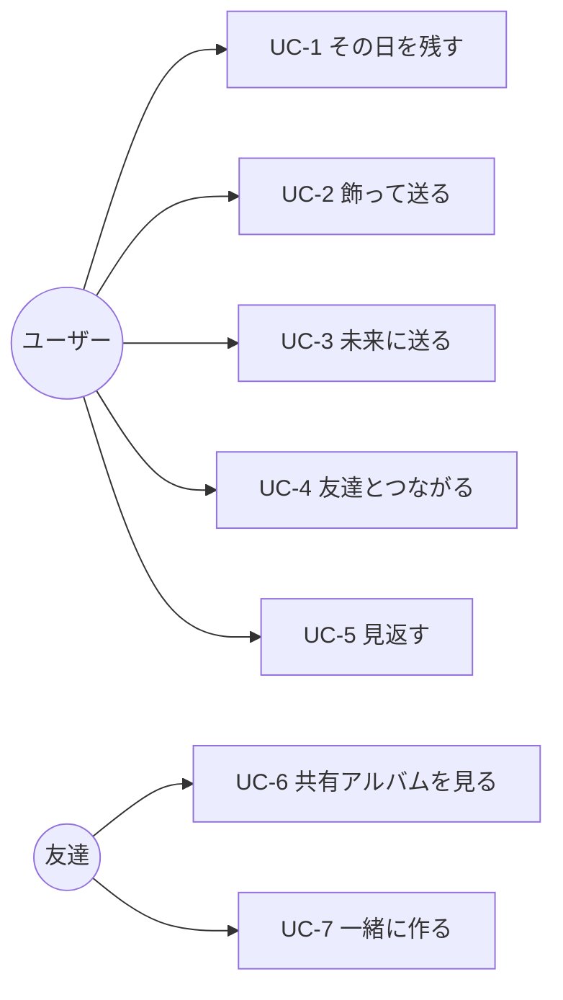

# 01 — Requirements / 要件定義

> 何を作るか、なぜ作るか、どこまでやるか。設計の前にここで合意する。

Project: **ai** — Hanamizuki AI Hackathon, 2026-09-26 10:45 → 09-27 19:00.
Reference: `image-1.png` (poster), `frontend/MOCK_SPEC.md` (8 screens).

---

## 1. Background

> 背景。「写真は撮るのに、見返さない」という日常の問題を解く。

The hackathon theme is *"do something with AI"*, where **AI** also reads as
*ai* — 愛 (love), 目 (eye), 私 (I), 藍 (indigo) — and asks for a problem from
this week's work or daily life.

The problem we picked:

> 友達と遊んだ日に何十枚も写真を撮る。けれどカメラロールに埋もれて、
> 整理する気力がなく、結局その思い出は二度と見返されない。

Photos are *captured* constantly and *revisited* almost never. The friction is
not the camera — it is everything after the shutter: selecting, grouping,
titling, captioning, sharing. Every one of those steps is work, and all of it is
work an AI can do.

**Product statement**

> 撮るだけでいい。あとはAIがアルバムにして、ひとこと添えて、友達に届ける。

The poster's own flow (section 07) is the product in one line:

```
写真を撮る → AIが自動でアルバム作成 → デコレーション → 友達と共有 → タイムカプセル
```

---

## 2. Users

> 想定ユーザー。放課後に集まる3〜4人の高校生・大学生グループ。

The poster is explicit about who this is for: 放課後, プリクラ, 梅田,
テスト終わり, 「あやか・みき・りん」. We design for that, not for a general
photo-management audience.

| | Primary persona |
| --- | --- |
| Who | 高校生・大学生、3〜4人の仲良しグループ |
| Device | スマートフォン（iOS Safari / Android Chrome）のみ。PCは使わない |
| Situation | 放課後・休日に集まり、その場で何十枚も撮る |
| Pain | 撮った直後は盛り上がるが、整理しないまま埋もれる |
| Existing habit | LINEのアルバム機能は使うが、手動で選ぶのが面倒 |
| What they want | 手間ゼロで「その日」がまとまり、可愛く飾れて、すぐLINEで送れる |

**Secondary**: the same group one year later, opening the time capsule. This
persona never uses the app — they only receive it — but they are the reason the
capsule exists.

**Non-users (explicitly)**: プロカメラマン, 業務利用, 大量写真の管理.
Anyone who wants folders, tags, or control is not our user — we are betting on
*not asking the user to organise anything*.

---

## 3. Use cases

> ユースケース。UC-1〜UC-3がコア、UC-4以降は支え。



| ID | Use case | Actor | Summary |
| --- | --- | --- | --- |
| UC-1 | その日を残す | User | 撮る → まとめてアップ → AIが日ごとのアルバムを作る |
| UC-2 | 飾って送る | User | 手書き・スタンプで飾り、LINEで友達に送る |
| UC-3 | 未来に送る | User | アルバムを封印し、開封日を決める |
| UC-4 | 友達とつながる | User | 検索して申請、承認して友達になる |
| UC-5 | 見返す | User | アルバム一覧・写真の詳細情報を見る |
| UC-6 | 共有アルバムを見る | Friend | ログイン不要、リンクだけで閲覧 |
| UC-7 | 一緒に作る | Friend | メンバーとして写真追加・装飾 |

### UC-1 detail — the core loop

```
1. ユーザーがアプリでカメラを開き、写真を撮る（複数枚）
2. 「AIでアルバムにまとめる」を押す
3. システムが撮影時刻でグループ分けする         ← 決定的処理
4. システムがAIにタイトル・説明・天気を生成させる  ← AI処理
5. アルバムが1件以上できあがり、表示される

代替フロー 4a: AIが失敗した場合
  → 日付ベースのタイトルでアルバムを作り、処理は成功として終える
  → ユーザーにエラーは見せない
```

Step 4a is a requirement, not an implementation detail. **The demo must not be
able to show an error screen**, and a hackathon venue's Wi-Fi is not something
we control.

---

## 4. Functional requirements

> 機能要件。P0はデモ必須、P1は余裕があれば、P2は切ってよい。

| ID | Requirement | Screen | Priority |
| --- | --- | --- | --- |
| **FR-01** | ブラウザのカメラで写真を撮影できる | 02 | **P0** |
| FR-01.1 | 端末のライブラリからも選択できる | 02 | P1 |
| **FR-02** | 撮影・選択した写真を複数枚まとめてアップロードできる | 02→03 | **P0** |
| FR-02.1 | 撮影時刻・位置情報を自動で取り出す | — | **P0** |
| FR-02.2 | 画像の向きを自動補正する | — | **P0** |
| **FR-03** | AIが写真を自動でアルバムにまとめる | 03 | **P0** |
| FR-03.1 | 撮影時刻でグループ分けし、1回の操作で複数アルバムができる | 03 | **P0** |
| FR-03.2 | アルバムのタイトル・説明をAIが生成する | 03,04 | **P0** |
| FR-03.3 | 写真ごとの短いキャプションをAIが生成する | 03 | **P0** |
| FR-03.4 | 表紙をAIが選ぶ | 03 | P1 |
| FR-03.5 | 天気・場所を画像からAIが推定する | 08 | P1 |
| FR-03.6 | AI失敗時も規則ベースでアルバムを作る | — | **P0** |
| **FR-04** | 写真の上に手書きで線を描ける | 04 | **P0** |
| FR-04.1 | 文字を入れられる（手書き風フォント） | 04 | **P0** |
| FR-04.2 | スタンプを貼れる | 04 | P1 |
| FR-04.3 | 装飾を後から編集・取り消しできる | 04 | **P0** |
| FR-04.4 | フィルターをかけられる | 04 | P2 |
| **FR-05** | アルバムの共有リンクを発行できる | 05 | **P0** |
| FR-05.1 | LINE等にネイティブ共有シートで送れる | 05 | **P0** |
| FR-05.2 | 共有リンクがLINEでプレビューカードとして表示される | — | **P0** |
| FR-05.3 | 受け取った側はログイン不要で閲覧できる | — | **P0** |
| FR-05.4 | 共有を取り消せる | 05 | P2 |
| **FR-06** | アルバムをタイムカプセルとして封印できる | 06 | P1 |
| FR-06.1 | 開封日まで中身が取得できない | 07 | P1 |
| FR-06.2 | 開封日に通知が届く | — | P2 |
| **FR-07** | アカウント名とパスワードで登録・ログインできる | 01 | **P0** |
| FR-07.1 | ログイン状態が保持される | — | **P0** |
| **FR-08** | ユーザーを検索して友達申請・承認できる | 05 | P1 |
| **FR-09** | アルバムに友達をメンバーとして追加できる | 05 | P1 |
| FR-09.1 | メンバーが写真追加・装飾できる | 05 | P1 |
| FR-09.2 | 同時編集の競合を検出できる（楽観ロック） | — | P1 |
| **FR-10** | 写真の詳細情報（場所・時間・音楽・コメント・メンバー・天気）を見られる | 08 | **P0** |
| FR-10.1 | 詳細情報を手で編集できる | 08 | P1 |
| **FR-11** | 友達申請・アルバム招待の通知が見られる | — | P2 |
| FR-12 | ユーザーをブロックできる | — | P2 |

**P0 count: 20.** That is the demo. Everything else is buffer.

> スキーマは全要件を収容する。P1/P2 を「作らない」と「置き場所がない」は違う。
> 列と表は最初から用意しておき、実装を後回しにするだけにする
> （`backend/sql/create_table.sql`）。

---

## 5. Non-functional requirements

> 非機能要件。デモが5分で止まらないことが最優先。

| ID | Category | Requirement | Verification |
| --- | --- | --- | --- |
| **NFR-01** | 性能 | 写真20枚のアルバム生成が **30秒以内** | 実測 |
| NFR-01.1 | 性能 | アップロード以外のAPIは **300ms以内** | 実測 |
| NFR-01.2 | 性能 | 生成中は進捗が見える（無言で待たせない） | 目視 |
| **NFR-02** | 可用性 | **AI障害時も機能縮退して完了する**。エラー画面を出さない | 障害注入 |
| NFR-02.1 | 可用性 | サーバー再起動後もデータが残る | 再起動試験 |
| NFR-02.2 | 可用性 | デモ用データを1コマンドで再投入できる | `/api/dev/seed` |
| **NFR-03** | セキュリティ | 他人のアルバム・写真・カプセルにアクセスできない | 手動試験 |
| NFR-03.1 | セキュリティ | 共有トークンは推測不能（128bit以上） | 設計レビュー |
| NFR-03.2 | セキュリティ | 封印中のカプセル内容を **サーバーが返さない** | API直叩き試験 |
| NFR-03.3 | セキュリティ | 保存・共有される画像からEXIFを除去する | ファイル検査 |
| NFR-03.4 | セキュリティ | パスワードはハッシュ化して保存する | コードレビュー |
| NFR-03.5 | セキュリティ | APIキーをリポジトリに含めない | `.gitignore` |
| **NFR-04** | 互換性 | iOS Safari / Android Chrome の最新版で動く | 実機確認 |
| NFR-04.1 | 互換性 | カメラ・共有APIのため **HTTPSで提供する** | 必須 |
| NFR-04.2 | 互換性 | 画面幅 390px を基準に設計する | 既存モック準拠 |
| **NFR-05** | 操作性 | 撮影から共有まで **5タップ以内** | 導線確認 |
| NFR-05.1 | 操作性 | 文言は日本語 | — |
| **NFR-06** | コスト | アルバム1件あたりのAI費用 **$0.20以内** | `count_tokens` |
| NFR-06.1 | コスト | 1ユーザー1日20回まで | レート制限 |
| **NFR-07** | 保守性 | コード・コメント・コミットは英語 | `README.md` 準拠 |
| NFR-07.1 | 保守性 | 1機能1ブランチ、PRでmergeする | `README.md` 準拠 |

### NFR-02 — degradation is a requirement

> 機能縮退の定義。何が落ちたら何を諦めるか。

| 障害 | 縮退動作 | ユーザーに見える変化 |
| --- | --- | --- |
| Claude API 到達不可 | 撮影時刻ベースのタイトルでアルバム作成 | AIっぽい説明文が出ない |
| Claude 応答が不正 | 不正な項目だけ捨てる | 一部のキャプションが空 |
| EXIF なし | アップロード時刻でグループ分け | 「場所」「時間」行が出ない |
| GPS なし | AIが画像から場所を推定、無理なら非表示 | 「場所」行が出ない |
| 装飾PNGの生成失敗 | 元画像をそのまま共有 | 手書きが共有先に出ない |
| ネットワーク断 | 直前まで表示していたアルバムは見える | 新規生成のみ不可 |

---

## 6. Constraints

> 制約。時間・人数・審査基準が設計を決める。

| | |
| --- | --- |
| 開発期間 | 2026-09-26 10:45 → 09-27 19:00（実働 約20時間） |
| 発表 | 5分間のデモ＋説明 |
| 技術 | React + TypeScript (Vite) / Spring Boot 4.1 + Java 21 |
| 既存資産 | 8画面の静的モックのみ。API・永続化はゼロ |
| ネットワーク | 会場Wi-Fi。低速・不安定を前提にする |
| 実機 | HTTPSトンネル（cloudflared 等）が必須 |

### Judging criteria → design pressure

> 審査基準がどこに効くか。完成度と面白さに全振りする。

| 基準 | 設計への影響 |
| --- | --- |
| コンセプト | 「撮るだけ」を一言で言い切る。機能を足さない |
| 新規性 | AIが *分類* ではなく *言葉* を作る点を前面に出す |
| **完成度・技術力** | **動くこと > 機能数**。P0 20件を確実に落とす |
| 面白さ | 手書き装飾とタイムカプセル。ここが「人に見せたくなる」部分 |
| プレゼン | デモが5分で完走できる導線を最初から設計する |

---

## 7. Out of scope

> 対象外。やらないことを明示して、当日の判断を速くする。

- 動画の撮影・保存
- ネイティブアプリ（iOS / Android）
- 課金・広告
- 日本語以外の言語
- 写真の全文検索・タグ付け・フォルダ管理（**思想として作らない**）
- LINE Login / LIFF / Messaging API（Web Share APIで代替）
- 本番運用を想定したスケーラビリティ・監視・バックアップ
- パスワードリセット（メール送信基盤がない）

---

## 8. Acceptance — the 5-minute demo

> 受け入れ基準。この一連の流れが通ればデモは成立する。

```
 0:00  ログイン画面から「はじめる」
 0:20  カメラで3枚撮影
 0:40  「AIでアルバムにまとめる」を押す
 1:10  タイトル「最高の1日」と各写真のキャプションが自動で付いて表示される
 1:30  1枚を選び、手書きで「Best Friends ♡」と書く、ハートのスタンプを貼る
 2:10  「保存して友達とシェア」
 2:30  共有ボタン → LINEを選択 → プレビューカードにアルバム表紙が出る
 3:00  受け取った側の画面をログアウト状態で開いて見せる
 3:30  「タイムカプセルを作成する」→ 1年後を指定
 4:00  （開発用）即時開封して、1年後に届く体験を見せる
 4:30  まとめ
```

Each line maps to at least one P0 requirement. A requirement that appears
nowhere in this timeline is, by definition, not P0.

**Rehearsal rule**: the full timeline must be run end-to-end at least twice on
the actual demo device before 09-27 12:00.

---

## 9. Open questions

> 未決事項。設計を進めながら潰す。

### 決定済み

| # | Question | 決定 | 決定日 |
| --- | --- | --- | --- |
| Q-1 | 認証方式 | JWT。ログインIDは **`userAccount`**（メールではない。送信基盤がないため） | 09-22 |
| Q-6 | DBは何か | **MySQL 8**。`backend/sql/create_table.sql` が唯一の正 | 09-22 |
| Q-7 | 各自のDB環境 | ルートの `docker-compose.yml`。`docker compose up -d` で起動＋スキーマ投入 | 09-22 |
| Q-8 | 装飾データの持ち方 | `album_photo.overlayData`（JSON、座標 0〜1 正規化）が真実、PNGは描画キャッシュ | 09-22 |
| Q-9 | 生成ジョブの進捗 | `album_job.progress`（0〜100）を持つ | 09-22 |
| Q-10 | 生成の冪等性 | **付ける。** `album_job.idempotencyKey` + `uk_userId_idempotencyKey` | 09-22 |
| Q-11 | スキーマの範囲 | **P2要件まで含めた全件を用意する。** 実装順で絞り、スキーマでは絞らない | 09-22 |

### 未決

| # | Question | Blocks | 期限 |
| --- | --- | --- | --- |
| Q-2 | デモ撮影はiPhoneか（HEIC対応が要るか） | FR-02 | **着手前** |
| Q-3 | チーム人数と分担（フロント/バック） | 全体 | 着手前 |
| Q-4 | HTTPSトンネルはcloudflaredでよいか | NFR-04.1 | 09-26 午前 |
| Q-5 | 「音楽」行は手入力で作るか、削るか | FR-10 | 09-26 午前 |
| Q-12 | 装飾を `album_photo` の列で持つか、`decoration` 表に分けるか | FR-04 | **着手前** |
| Q-13 | **`ANTHROPIC_API_KEY` が未取得** | FR-03, FR-07(プリクラ) | **09-25 まで** |

Q-13: キーが無い間、AI呼び出しは実装済みだが常に失敗し、規則ベースに縮退する。
つまり **FR-03.6（AI失敗時のフォールバック）は毎回通っているので検証済み**だが、
FR-03.2〜3.5（タイトル・キャプション・天気の生成）は一度も動いていない。
デモの見せ場が丸ごとこの1つのキーに乗っているので、09-26 当日に取るのでは遅い。

Q-12: 現行スキーマは `album_photo.overlayData / overlayPath / compositePath` の
3列で持つ。一方、実装側には独立した `Decoration` エンティティが存在する。
どちらか一方に寄せないとマッピングが成立しない。
