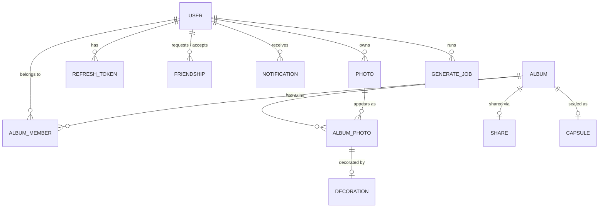
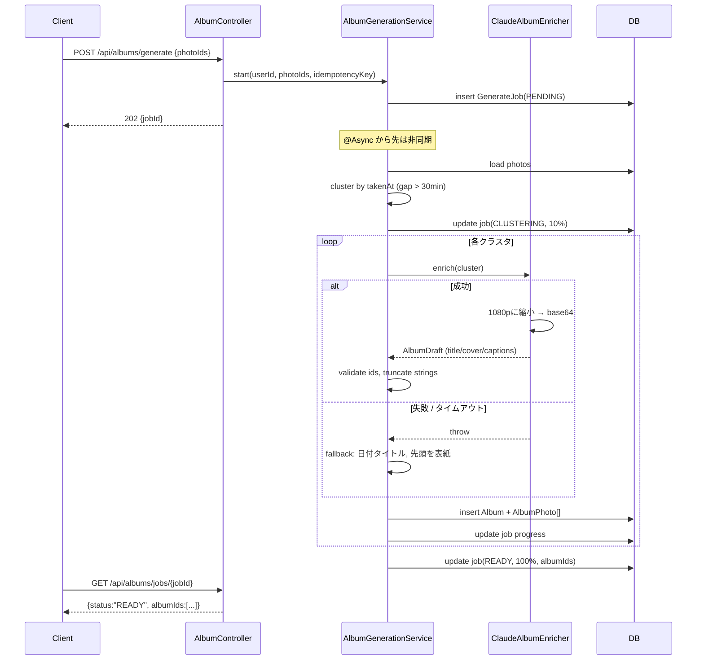
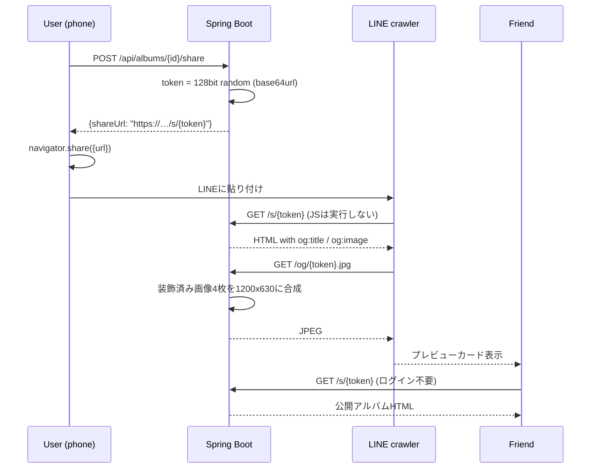
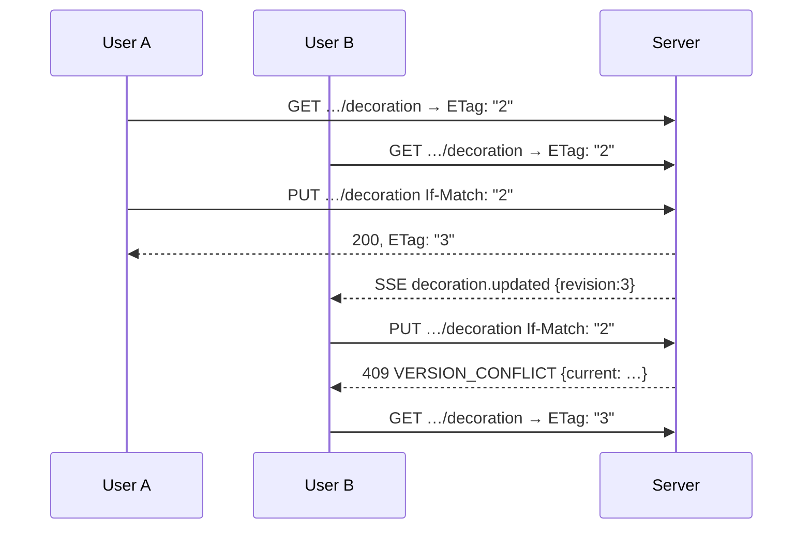

# 02 — Basic Design / 基本設計

> どう作るか、の骨組み。構成・技術選定・データモデル・主要フローを決める。
> 前提: `01-requirements.md`

---

## 1. System architecture

> 全体構成。開発中は2プロセス、デモ時は1オリジンに寄せる。

### 1.1 Development

```
┌────────────┐   /api/*    ┌──────────────┐
│ Vite :5173 │ ──proxy───► │ Spring :8080 │
│  React SPA │             │   REST API   │
└────────────┘             └──────┬───────┘
                                  │
                   ┌──────────────┼──────────────┐
                   ▼              ▼              ▼
              ┌─────────┐   ┌──────────┐   ┌───────────┐
              │ H2 file │   │ ./storage│   │ Claude API│
              │  (JPA)  │   │  photos  │   │  (vision) │
              └─────────┘   └──────────┘   └───────────┘
```

### 1.2 Demo — single origin behind one HTTPS tunnel

```
┌─────────────┐  HTTPS  ┌─────────────┐  ┌──────────────────────────┐
│ スマートフォン │ ──────► │ cloudflared │─►│ Spring Boot :8080        │
│ Safari/Chrome│         │   tunnel    │  │  ├ /            → SPA    │
└─────────────┘         └─────────────┘  │  ├ /api/*       → REST   │
                                          │  ├ /s/{token}   → SSR    │
                                          │  └ /og/{t}.jpg  → image  │
                                          └──────────────────────────┘
```

**Decision: for the demo, Spring Boot serves the built SPA from
`src/main/resources/static/`, not Vite.**

Three reasons, all of which bite otherwise:

1. `getUserMedia` and `navigator.share` require HTTPS. One tunnel to one port is
   one thing to go wrong; two is more.
2. The LINE crawler fetches `/s/{token}` and `/og/{token}.jpg`. Those are
   **not** under `/api/*`, so the Vite proxy would not forward them.
3. Same origin removes every CORS question at exactly the moment nobody has time
   to debug CORS.

Cost: one `npm run build && cp -r dist/* ../backend/src/main/resources/static/`
step. Worth automating on 09-26 morning, not 09-27 evening.

### 1.3 Technology choices

> 技術選定。既存資産と「20時間で落とす」ことから逆算する。

| Layer | Choice | Why |
| --- | --- | --- |
| Frontend | React 19 + Vite 8 + react-router 7 | 8画面のモックが既にある。捨てない |
| Drawing | Canvas 2D (no library) | 線・文字・スタンプだけ。ライブラリ学習コストが割に合わない |
| Backend | Spring Boot 4.1 / Java 21 | 既存スキャフォールド |
| Persistence | **H2 (file mode) + Spring Data JPA** | 友達・メンバーが多対多。手書きMapより速い。再起動で消えない |
| Image | Java2D (`ImageIO`) + `metadata-extractor` | 回転・縮小・合成・EXIF。追加依存2つで済む |
| AI | `com.anthropic:anthropic-java`, `claude-opus-4-8` | 公式SDK。構造化出力がrecordから生成できる |
| Auth | Spring Security + JWT (`jjwt`) | NFR-03を満たす最小構成 |
| Tunnel | cloudflared | 無料・アカウント不要・URL即発行 |

**Rejected**: Redis (H2で足りる), Docker (会場で組むには重い), WebSocket
(SSEで足りる), LIFF (登録と審査が間に合わない), S3 (ローカルFSで足りる).

---

## 2. Backend structure

> バックエンド構成。4層＋外部連携。層をまたぐ呼び出しは下向きのみ。

```
com.hanamizuki.backend
├── api/              Controller + Request/Response DTO
│   ├── auth/  user/  friend/  photo/  album/
│   ├── decoration/   share/   capsule/  notification/
│   └── dev/          （seed・unseal-now。devプロファイルのみ）
├── service/          ビジネスロジック。トランザクション境界はここ
│   ├── AuthService            PhotoService
│   ├── FriendService          AlbumService
│   ├── AlbumGenerationService ← ジョブ実行の中核
│   ├── DecorationService      ShareService
│   └── CapsuleService         NotificationService
├── domain/           JPA Entity + Enum。ロジックを持たない
├── repository/       Spring Data JPA インターフェース
├── integration/
│   ├── ai/           ClaudeAlbumEnricher, AlbumDraft, PhotoInsight
│   ├── storage/      PhotoStorage（ローカルFS実装）
│   └── image/        ExifReader, ImageProcessor, CollageRenderer
├── security/         JwtFilter, JwtIssuer, SecurityConfig, CurrentUser
├── common/           ApiError, GlobalExceptionHandler, CursorPage
└── config/           AsyncConfig, StorageConfig, RateLimitConfig
```

Dependency rule: `api → service → repository → domain`, and
`service → integration`. `integration` never imports `api` or `service`. This is
enforced by review, not by a build plugin — there is no time for the plugin.

---

## 3. Data model

> データモデル。AlbumPhotoが中心。写真は複数アルバムに属しうる。



### 3.1 Why `ALBUM_PHOTO` exists

> なぜ中間テーブルを独立エンティティにするか。

A photo can appear in more than one album, and the **caption, ordering, and
decoration belong to the pairing**, not to the photo. The same shot decorated
one way in 「放課後プリクラ」 and another way in 「2026 まとめ」 is a normal case,
not an edge case.

Consequence that must be visible in the API: **every decoration and metadata
call addresses the `AlbumPhoto` id (`ap_…`), never the `Photo` id.** Getting
this wrong later means rewriting half the endpoints.

### 3.2 Field provenance

> 各フィールドの出どころ。自動取得できるのは時刻と位置だけ。

| Field | Source | Fallback |
| --- | --- | --- |
| `takenAt` (時間) | EXIF `DateTimeOriginal` | アップロード時刻 |
| `lat` / `lng` | EXIF GPS | なし |
| `place` (場所) | GPS逆ジオコーディング | **Claudeが看板・風景から推定** |
| `weather` (天気) | **Claudeが空を判定** | `null`（行を非表示） |
| `caption` | **Claude** | `null` |
| `comment` (コメント) | **Claude**、編集可 | 空 |
| `members` (メンバー) | アルバムメンバー | 投稿者のみ |
| `music` (音楽) | **手入力のみ** | `null`（行を非表示） |
| album `title` | **Claude** | `"YYYY.MM.DD のアルバム"` |
| album `coverPhotoId` | **Claude** が選ぶ | `takenAt` 最古 |

天気を画像から判定するのは、GPSも外部APIキーも不要で、失敗しても `null` に
落ちるだけだから。外部天気APIを足すと障害点が1つ増える。

---

## 4. Screen ↔ API mapping

> 画面とAPIの対応。モックの8画面がどのAPIを叩くか。

| # | Screen | Route | APIs |
| --- | --- | --- | --- |
| 01 | Home | `/` | `POST /api/auth/login`, `GET /api/auth/me` |
| 02 | Camera | `/camera` | `POST /api/photos` |
| 03 | Album create | `/album/new` | `GET /api/photos?unassigned=true`, `POST /api/albums/generate`, `GET /api/albums/jobs/{id}` |
| 04 | Decorate | `/album/decorate` | `GET/PUT …/decoration`, `POST …/decoration/rendered` |
| 05 | Share | `/album/share` | `GET /api/friends`, `POST /api/albums/{id}/members`, `POST /api/albums/{id}/share` |
| 06 | Capsule create | `/capsule/new` | `POST /api/capsules` |
| 07 | Capsule done | `/capsule/done` | `GET /api/capsules/{id}` |
| 08 | Detail | `/album/detail` | `GET /api/albums/{id}` |
| — | Public share | `/s/{token}` | SSR (no SPA) |

The existing mock navigates with `navigate()` only; every screen needs state
wiring. **The frontend work is not "add fetch calls" — it is introducing state
management where there is currently none.**

---

## 5. Main flows

> 主要フロー。生成と共有の2つが設計上の山場。

### 5.1 Album generation (UC-1)



Two points that are design decisions, not details:

- **One request can produce several albums.** 30 photos across two afternoons is
  two albums. The client polls a *job*, not an album.
- **The AI branch cannot fail the job.** `catch` is inside the loop and the
  fallback path reaches `READY`. `FAILED` is reserved for bad input.

### 5.2 Share to LINE (UC-2)



**`/s/{token}` must be server-rendered.** The LINE crawler does not run
JavaScript; a React page yields a card with no title and no image. This is the
single hardest constraint in the whole design, and it is why §1.2 puts the SPA
behind Spring Boot instead of the reverse.

### 5.3 Collaborative decoration (UC-7)



Albums are multi-user by design (FR-09), so silent last-write-wins is a data-loss
bug, not a simplification. Optimistic locking via `ETag` / `If-Match` is the
cheapest correct answer; SSE just saves the other client a poll.

---

## 6. Cross-cutting design

> 横断的な設計方針。個々のAPIで揺れないように先に決める。

### 6.1 Authentication

> 認証。アクセストークン15分、リフレッシュ30日、ローテーションあり。

| Token | Lifetime | Storage |
| --- | --- | --- |
| access | 15 min | メモリ（フロント）、`Authorization: Bearer` |
| refresh | 30 days | localStorage、サーバー側はハッシュで保持 |

401 + `code: TOKEN_EXPIRED` → クライアントは1回だけ `/api/auth/refresh` して元の
リクエストを再送。それ以外の401はログアウト。リフレッシュは使い捨て（rotation）、
失効済みトークンの再利用を検知したらそのユーザーの全セッションを失効させる。

### 6.2 Error format

> エラー形式。全APIで同一。codeで分岐し、messageは表示用。

```json
{ "code": "ALBUM_FORBIDDEN", "message": "…", "details": null, "traceId": "b3f1…" }
```

`@RestControllerAdvice` 1か所で組み立てる。コード一覧は `03-detailed-design.md` §4。

### 6.3 Concurrency

> 同時編集。Album と AlbumPhoto と Decoration は版番号で守る。

`version` / `revision` を `ETag` として返し、更新系は `If-Match` 必須。
未指定は **428 Precondition Required** で弾く。暗黙の上書きより明示的なエラー。

### 6.4 Async and rate limiting

> 非同期と流量制御。課金するAPIだけ厳しく絞る。

生成ジョブは `@Async` + 固定スレッドプール（size 2）。同一ユーザーの同時実行は1件。
`POST /api/albums/generate` と `POST /api/photos` は `Idempotency-Key` 必須 ——
会場のWi-Fiで再送が起きたときに二重課金しないため。

### 6.5 Storage layout

> ファイル配置。DBにはパスだけを持ち、実体はFSに置く。

```
./storage/
├── photos/{yyyy}/{MM}/{photoId}.jpg      オリジナル（回転補正済・EXIF除去済）
├── thumbs/{photoId}_{w}.jpg              200/400/800px
├── decorations/{albumPhotoId}_{rev}.png  装飾レイヤー（透過）
├── rendered/{albumPhotoId}_{rev}.jpg     写真＋装飾の合成結果
└── og/{shareToken}.jpg                   1200x630 コラージュ
```

`{rev}` をパスに含めることでキャッシュ破棄が自動になる。`immutable` を付けて返せる。

---

## 7. Deliverable split

> 分担案。フロントとバックの境界はAPI契約。

| | Frontend | Backend |
| --- | --- | --- |
| P0 | 状態管理導入、カメラ、アップロード、生成待ち、Canvas装飾、共有シート | 認証、写真取込、クラスタリング、Claude連携、装飾保存、共有SSR+OG |
| P1 | 友達選択、メタデータ編集、カプセル作成 | 友達、メンバー、カプセル、SSE |
| 共同 | API契約の確定（着手前）、実機リハーサル（09-27午前） | 同左 |

**契約を先に固めること。** フロントは今 fetch が1行もないので、バックが
モックレスポンスを返すだけでも並行作業が始められる。

---

## 8. Risks

> リスク。発生したら何をするかまで決めておく。

| # | Risk | 影響 | 対策 |
| --- | --- | --- | --- |
| R-1 | LINEプレビューが出ない | FR-05.2 失敗、デモの山場が潰れる | 09-26中にOGだけ先に実装し実機確認。ダメならQRコード提示に切替 |
| R-2 | iPhoneのHEICが読めない | 写真が1枚も入らない | 09-26午前に判定。必要なら`imageio-heif`かフロントでJPEG変換 |
| R-3 | 会場Wi-FiでClaudeが遅い/落ちる | 生成が止まる | 機能縮退（NFR-02）。事前生成済みアルバムをseedに含める |
| R-4 | トンネルURLが変わる | 共有リンクが死ぬ | 共有URLはDBに絶対URLを保存せず、リクエストホストから組み立てる |
| R-5 | 同時編集の実装が間に合わない | FR-09.2 | P1。`If-Match`だけ実装しSSEは捨てる |
| R-6 | 時間切れ | 全体 | P0 20件を09-27 12:00までに凍結。以降は新規実装しない |

R-4 は設計で消える種類のリスクなので、**共有URLの組み立ては必ずリクエストの
`Host` ヘッダから行う**。`application.properties` にベースURLを書いた瞬間、
トンネル再接続でリンクが全部死ぬ。

---

## 9. Decisions still open

> 未決。`01-requirements.md` §9 と同期する。

| # | Decision | 本書の前提 |
| --- | --- | --- |
| Q-1 | 認証の深さ | JWT + refresh で書いている |
| Q-2 | HEIC対応 | 未対応（P1）で書いている |
| Q-3 | 装飾の描画主体 | **クライアント描画**で書いている（§5.3, 03書 §5.4） |
| Q-4 | デモ配信方式 | Spring Bootが静的配信する単一オリジン（§1.2） |
