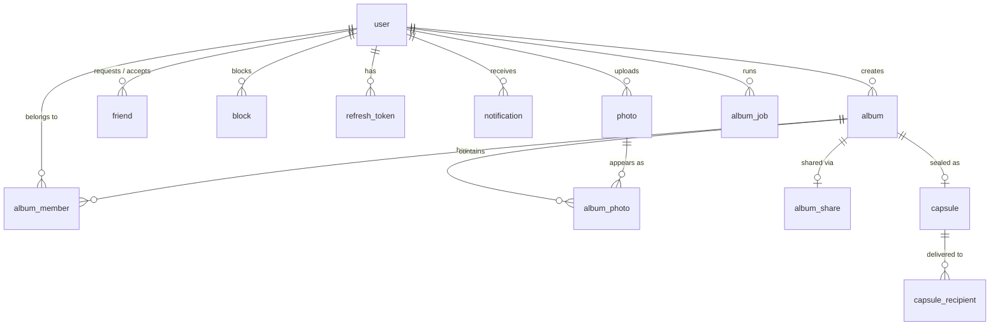
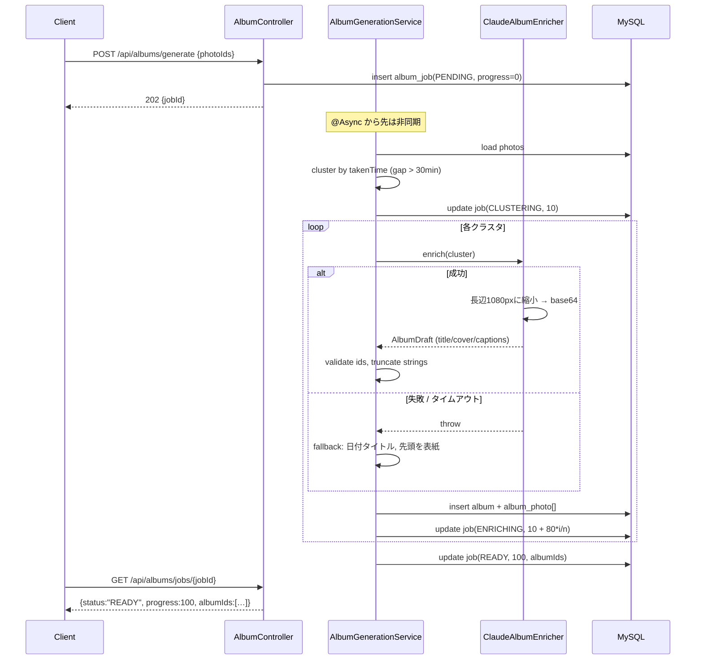
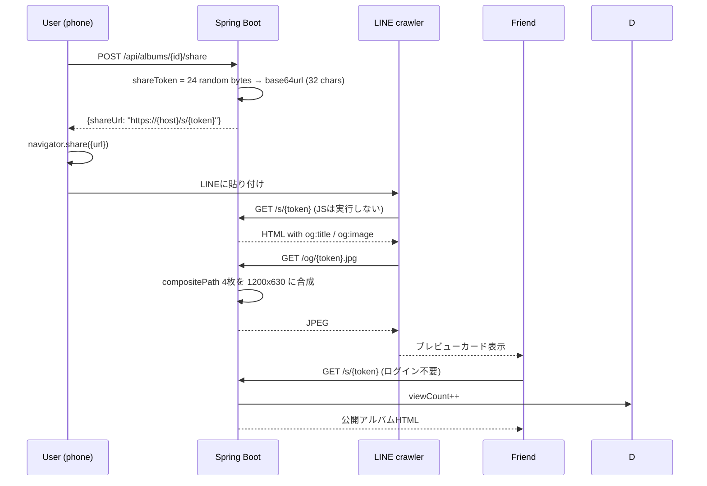
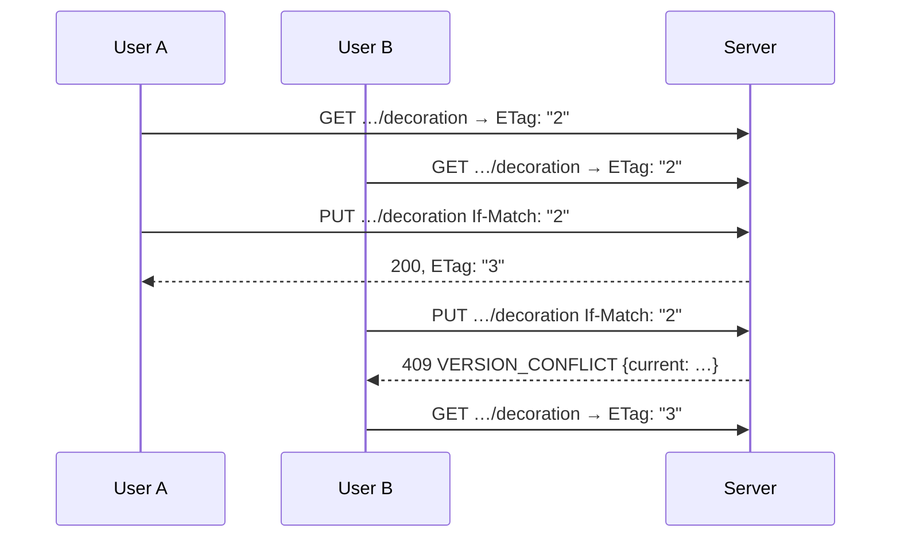

# 02 — Basic Design / 基本設計

> どう作るか、の骨組み。構成・技術選定・データモデル・主要フローを決める。
> 前提: `01-requirements.md` ／ スキーマの正: `backend/sql/create_table.sql`

**Schema authority**: this document describes *why* the schema looks the way it
does. The schema itself lives in `backend/sql/create_table.sql` and that file
wins any disagreement. Do not restate column definitions here.

---

## 1. System architecture

> 全体構成。開発中は2プロセス、デモ時は1オリジンに寄せる。

### 1.1 Development

```
┌────────────┐   /api/*    ┌──────────────┐
│ Vite :5173 │ ──proxy───► │ Spring :8080 │
│  React SPA │             │   REST API   │
└────────────┘             └──────┬───────┘
                                  │
                   ┌──────────────┼──────────────┐
                   ▼              ▼              ▼
           ┌───────────────┐ ┌──────────┐  ┌───────────┐
           │ MySQL 8       │ │ ./storage│  │ Claude API│
           │ (docker-      │ │  photos  │  │  (vision) │
           │  compose)     │ └──────────┘  └───────────┘
           └───────────────┘
```

`docker compose up -d` starts MySQL **and** applies `create_table.sql` on first
boot. Nobody installs MySQL by hand; nobody runs the DDL by hand.

> スキーマを変えたら `docker compose down -v && docker compose up -d`。
> 初期化スクリプトはボリュームが空のときしか走らない。

### 1.2 Demo — single origin behind one HTTPS tunnel

```
┌─────────────┐  HTTPS  ┌─────────────┐  ┌──────────────────────────┐
│ スマートフォン │ ──────► │ cloudflared │─►│ Spring Boot :8080        │
│ Safari/Chrome│         │   tunnel    │  │  ├ /            → SPA    │
└─────────────┘         └─────────────┘  │  ├ /api/*       → REST   │
                                          │  ├ /s/{token}   → SSR    │
                                          │  └ /og/{t}.jpg  → image  │
                                          └──────────────────────────┘
```

**Decision: for the demo, Spring Boot serves the built SPA from
`src/main/resources/static/`, not Vite.**

1. `getUserMedia` and `navigator.share` require HTTPS. One tunnel to one port is
   one thing to go wrong; two is more.
2. The LINE crawler fetches `/s/{token}` and `/og/{token}.jpg`. Those are **not**
   under `/api/*`, so the Vite proxy would not forward them.
3. Same origin removes every CORS question at exactly the moment nobody has time
   to debug CORS.

Cost: one `npm run build && cp -r dist/* ../backend/src/main/resources/static/`.
Automate it on 09-26 morning, not 09-27 evening.

### 1.3 Technology choices

> 技術選定。既存資産と「20時間で落とす」ことから逆算する。

| Layer | Choice | Why |
| --- | --- | --- |
| Frontend | React 19 + Vite 8 + react-router 7 | 8画面のモックが既にある。捨てない |
| Drawing | Canvas 2D（ライブラリなし） | 線・文字・スタンプだけ。学習コストが割に合わない |
| Backend | Spring Boot 4.1 / Java 21 | 既存スキャフォールド |
| Persistence | **MySQL 8 + Spring Data JPA** | チームの標準。`json` 型と `on update CURRENT_TIMESTAMP` を使う |
| DB環境 | **docker-compose** | 各自インストール不要。スキーマ投入まで自動 |
| Image | Java2D (`ImageIO`) + `metadata-extractor` | 回転・縮小・合成・EXIF。追加依存2つ |
| AI | `com.anthropic:anthropic-java`, `claude-opus-4-8` | 公式SDK。構造化出力がrecordから生成できる |
| Auth | Spring Security + JWT (`jjwt`) | NFR-03を満たす最小構成 |
| Tunnel | cloudflared | 無料・アカウント不要・URL即発行 |

**Rejected**: H2（`json` 型と `on update` が使えず、DDLを二重管理になる）、
Redis、Docker化したアプリ本体、WebSocket（SSEで足りる）、LIFF（審査が間に合わない）、
S3（ローカルFSで足りる）。

> ⚠️ `backend/pom.xml` と `application.properties` は現在 H2 向けになっている。
> `03-detailed-design.md` §6 の差分に従って MySQL へ切り替えること。

---

## 2. Backend structure

> バックエンド構成。4層＋外部連携。層をまたぐ呼び出しは下向きのみ。

```
com.hanamizuki.backend
├── api/              Controller + Request/Response DTO
│   ├── auth/  user/  friend/  photo/  album/
│   ├── decoration/   share/   capsule/
│   └── dev/          （seed・unseal-now。devプロファイルのみ）
├── service/          ビジネスロジック。トランザクション境界はここ
│   ├── AuthService            PhotoService
│   ├── FriendService          AlbumService
│   ├── AlbumGenerationService ← ジョブ実行の中核
│   ├── DecorationService      ShareService
│   └── CapsuleService
├── domain/           JPA Entity + Enum。ロジックを持たない
├── repository/       Spring Data JPA インターフェース
├── integration/
│   ├── ai/           ClaudeAlbumEnricher, AlbumDraft, PhotoInsight
│   ├── storage/      PhotoStorage（ローカルFS実装）
│   └── image/        ExifReader, ImageProcessor, CollageRenderer
├── security/         JwtFilter, JwtIssuer, SecurityConfig, CurrentUser
├── common/           ApiError, GlobalExceptionHandler, CursorPage
└── config/           AsyncConfig, StorageConfig
```

Dependency rule: `api → service → repository → domain`, and
`service → integration`. `integration` never imports `api` or `service`.
Enforced by review — there is no time for a build plugin.

---

## 3. Data model

> データモデル。全13テーブル。`album_photo` が中心。



**スキーマは要件の全件を収容する。** P1/P2 の機能も列と表だけは最初から用意し、
実装順で絞る。後からのテーブル追加は、動いているコードに触る作業になるため。

**No foreign keys.** Consistency is the application's job; only query indexes
exist. That is a deliberate house convention — it keeps `create_table.sql`
order-independent and makes the demo seed script trivial.

### 3.1 Why `album_photo` is not a plain join table

> なぜ中間テーブルを独立エンティティにするか。

A photo can appear in more than one album, and the **caption, ordering, and
decoration belong to the pairing**, not to the photo. The same shot decorated
one way in 「放課後プリクラ」 and another way in 「2026 まとめ」 is a normal case.

Consequence that must be visible in the API: **every decoration and metadata
call addresses `albumPhotoId`, never `photoId`.** Getting this wrong later means
rewriting half the endpoints.

Screen 08's six metadata rows land here, except 時間 (on `photo.takenTime`) and
メンバー (derived from `album_member`).

### 3.2 Why decoration is two columns, not one

> なぜ涂鸦を2列に分けるか。JSONが真実、PNGはキャッシュ。

| Column | Role |
| --- | --- |
| `album_photo.overlayData` (`json`) | **真実。** stroke / text / sticker / filter の要素配列 |
| `album_photo.overlayPath` | 上を描画したPNG。**キャッシュ。** 消えても再生成できる |
| `album_photo.compositePath` | 元画像＋PNG の合成結果。共有とOGが使う |

A flattened PNG alone cannot be undone stroke-by-stroke, cannot have a sticker
dragged, cannot have text re-typed. Screen 04 offers all three. So the element
list is the record and the image is derived.

**Coordinates are normalised to 0–1.** The phone canvas is 390 px wide and the
OG image is 1200 px wide; absolute pixels would misplace every sticker.

### 3.3 Field provenance

> 各フィールドの出どころ。自動取得できるのは時刻と位置だけ。

| 画面08の行 | 列 | Source | Fallback |
| --- | --- | --- | --- |
| 時間 | `photo.takenTime` | EXIF `DateTimeOriginal` | アップロード時刻 |
| — | `photo.latitude/longitude` | EXIF GPS | なし |
| 場所 | `album_photo.place` | GPS逆ジオコーディング | **Claudeが看板・風景から推定** |
| 天気 | `album_photo.weather` | **Claudeが空を判定** | `null`（行を非表示） |
| — | `album_photo.caption` | **Claude** | `null` |
| コメント | `album_photo.photoComment` | **Claude**、編集可 | 空 |
| メンバー | `album_member` から導出 | — | 作成者のみ |
| 音楽 | `album_photo.music` | **手入力のみ** | `null`（行を非表示） |
| — | `album.title` | **Claude** | `"YYYY.MM.DD のアルバム"` |
| — | `album.coverPhotoId` | **Claude** が選ぶ | `takenTime` 最古 |

天気を画像から判定するのは、GPSも外部APIキーも不要で、失敗しても `null` に
落ちるだけだから。外部天気APIを足すと障害点が1つ増える。

### 3.4 Denormalisation

> 冗余方針。一覧も詳細も join しない。整合性は規則で担保する。

House rules, carried from the team's reference schema:

1. カウントは冗余列（`album.photoNum`）。`count(*)` を撃たない
2. 配列は varchar の json（`album_job.photoIds`）。子テーブルに割らない
3. 表示に要る他表の列は複製する（`album_photo.photoUrl`, `album.coverThumbUrl`）

What this buys, concretely:

| 画面 | join なしで引ける理由 |
| --- | --- |
| アルバム一覧 | `album.coverThumbUrl` / `photoNum` / `memberNum` が同じ行にある |
| アルバム詳細（画面03/08） | `album_photo` が写真のURL・寸法・撮影時刻まで持つ。**2クエリ・0 join** |
| 友達一覧（画面05） | `friend.friendUserName` / `friendUserAvatar` |
| 公開共有ページ `/s/{token}` | `album_share` 1行で完結。**LINEのクローラが叩く経路に join を置かない** |
| 未成册の写真（画面03） | `photo.albumNum = 0` の1条件。`not exists` を撃たない |

代償は整合性。**冗余列ごとに「源・同期タイミング・漂移時の影響」を
`create_table.sql` のコメントに明記し、全件を `03-detailed-design.md` §1.2.2
の表にまとめてある。** 同期タイミングは快照（複製して追随しない）と
跟随（源の更新時に必ず同期）の2種類だけ。

冗余列は必ず源から再計算できること。`POST /api/dev/rebuild-denorm` が全件を
再構築する。**冗余列が唯一のデータ源になった時点で、この方針は破綻する。**

---

## 4. Screen ↔ API mapping

> 画面とAPIの対応。モックの8画面がどのAPIを叩くか。

| # | Screen | Route | APIs |
| --- | --- | --- | --- |
| 01 | Home | `/` | `POST /api/auth/login`, `GET /api/auth/me` |
| 02 | Camera | `/camera` | `POST /api/photos` |
| 03 | Album create | `/album/new` | `GET /api/photos?unassigned=true`, `POST /api/albums/generate`, `GET /api/albums/jobs/{id}` |
| 04 | Decorate | `/album/decorate` | `GET/PUT …/decoration`, `POST …/decoration/rendered` |
| 05 | Share | `/album/share` | `GET /api/friends`, `POST /api/albums/{id}/members`, `POST /api/albums/{id}/share` |
| 06 | Capsule create | `/capsule/new` | `POST /api/capsules` |
| 07 | Capsule done | `/capsule/done` | `GET /api/capsules/{id}` |
| 08 | Detail | `/album/detail` | `GET /api/albums/{id}` |
| — | Public share | `/s/{token}` | SSR（SPAではない） |

The existing mock navigates with `navigate()` only. **The frontend work is not
"add fetch calls" — it is introducing state management where there is none.**

---

## 5. Main flows

> 主要フロー。生成と共有の2つが設計上の山場。

### 5.1 Album generation (UC-1)



Two points that are design decisions, not details:

- **One request can produce several albums.** 30 photos across two afternoons is
  two albums. The client polls a *job*, not an album.
- **The AI branch cannot fail the job.** `catch` is inside the loop and the
  fallback path reaches `READY` with `aiGenerated = 0`. `FAILED` is reserved for
  bad input (no photos, photos not owned by the caller).

### 5.2 Share to LINE (UC-2)



**`/s/{token}` must be server-rendered.** The LINE crawler does not run
JavaScript; a React page yields a card with no title and no image. This is the
single hardest constraint in the design, and it is why §1.2 puts the SPA behind
Spring Boot instead of the reverse.

### 5.3 Collaborative editing — optimistic locking

> 共同編集。`version` 列を ETag として返し、更新は If-Match 必須。

`album` and `album_photo` carry a `version` column (`@Version`). It is returned
as an `ETag`; every update must send `If-Match`. A mismatch is 409
`VERSION_CONFLICT` carrying the current representation, so the client can show a
merge prompt instead of silently losing a caption.



Albums are multi-user by design (FR-09), so silent last-write-wins is a
data-loss bug, not a simplification. `album_photo.overlayUserId` /
`overlayUpdateTime` additionally record who drew last, for display.

**Requests without `If-Match` on these routes are rejected 428 Precondition
Required** — an accidental overwrite is worse than an explicit error.

---

## 6. Cross-cutting design

> 横断的な設計方針。個々のAPIで揺れないように先に決める。

### 6.1 Authentication

> 認証。アクセス15分＋リフレッシュ30日。リフレッシュは使い捨て（ローテーション）。

Login is `userAccount` + `userPassword` (BCrypt). There is **no email** and no
password reset — sending mail is infrastructure we do not have.

| Token | Lifetime | Storage |
| --- | --- | --- |
| access | 15 min | メモリ（フロント）、`Authorization: Bearer` |
| refresh | 30 days | `refresh_token` テーブルに **SHA-256 ハッシュで** 保持 |

401 + `code: TOKEN_EXPIRED` → クライアントは1回だけ `/api/auth/refresh` して元の
リクエストを再送。それ以外の401はログアウト。

リフレッシュは **ローテーション**：使ったトークンは `revokeTime` を打ち、新しい
ものを同じ `familyId` で発行する。失効済みトークンが再び使われたら盗用とみなし、
**その `familyId` 全体を失効**させる。

`user.userRole` (`user` / `admin` / `ban`) is a global role. `ban` blocks login;
`admin` is unused in the demo but costs nothing to carry.

`user.lineUserId` is reserved for a future LINE Login and stays `null`.

### 6.2 Error format

> エラー形式。全APIで同一。`code` で分岐し、`message` は表示用。

```json
{ "code": "ALBUM_FORBIDDEN", "message": "…", "traceId": "b3f1…" }
```

`@RestControllerAdvice` 1か所で組み立てる。一覧は `03-detailed-design.md` §3.2。

### 6.3 Concurrency and idempotency

> 同時実行。書き込みは楽観ロック、課金APIは冪等キー。二重課金を二重に防ぐ。

- Album / decoration writes: **optimistic locking** via `version` + `If-Match`
  (§5.3).
- Generation jobs: two independent guards —
  1. **`Idempotency-Key` header** → `album_job.idempotencyKey`
     (`uk_userId_idempotencyKey`). A replayed key returns the original job
     instead of starting a new one.
  2. **One running job per user.** A second `POST /generate` while a job is
     `PENDING` / `CLUSTERING` / `ENRICHING` returns 409 `JOB_ALREADY_RUNNING`.

会場のWi-Fiは落ちる前提。1 が再送を、2 が並行実行を止める。どちらも
Claudeの二重実行（＝二重課金と重複アルバム）を防ぐためにある。

### 6.4 Async

> 非同期。固定スレッドプール2本。ジョブ状態はDBが唯一の正。

`@Async` + fixed pool of 2. Job state lives in `album_job`, not in memory, so a
restart mid-generation leaves a visible stuck row rather than a lost request.

### 6.5 Storage layout

> ファイル配置。DBにはパスだけを持ち、実体はFSに置く。

```
./storage/
├── photos/{yyyy}/{MM}/{photoId}.jpg   → photo.filePath      原寸（回転補正済・EXIF除去済）
├── thumbs/{photoId}_{w}.jpg           → photo.thumbPath     200/400/800px
├── overlays/{albumPhotoId}.png        → album_photo.overlayPath    透過
├── composites/{albumPhotoId}.jpg      → album_photo.compositePath  写真＋涂鸦
└── og/{shareToken}.jpg                                      1200x630
```

`overlayPath` / `compositePath` are overwritten in place on each save. Cache
busting is done with a query string derived from `overlayUpdateTime`, not with a
versioned filename — there is no revision counter in the schema.

---

## 7. Deliverable split

> 分担案。フロントとバックの境界はAPI契約。

| | Frontend | Backend |
| --- | --- | --- |
| P0 | 状態管理導入、カメラ、アップロード、生成待ち、Canvas装飾、共有シート | 認証、写真取込、クラスタリング、Claude連携、装飾保存、共有SSR+OG |
| P1 | 友達選択、メタデータ編集、カプセル作成 | 友達、メンバー、カプセル |
| 共同 | API契約の確定（着手前）、実機リハーサル（09-27午前） | 同左 |

**契約を先に固めること。** フロントは今 fetch が1行もないので、バックが
モックレスポンスを返すだけでも並行作業が始められる。

---

## 8. Risks

> リスク。発生したら何をするかまで決めておく。

| # | Risk | 影響 | 対策 |
| --- | --- | --- | --- |
| R-1 | LINEプレビューが出ない | FR-05.2 失敗、デモの山場が潰れる | 09-26中にOGだけ先に実装し実機確認。ダメならQRコード提示に切替 |
| R-2 | iPhoneのHEICが読めない | 写真が1枚も入らない | 09-26午前に判定（Q-2）。必要なら`imageio-heif`かフロントでJPEG変換 |
| R-3 | 会場Wi-FiでClaudeが遅い/落ちる | 生成が止まる | 機能縮退（NFR-02）。事前生成済みアルバムをseedに含める |
| R-4 | トンネルURLが変わる | 共有リンクが死ぬ | **共有URLはリクエストの`Host`ヘッダから組み立てる。** 設定ファイルにベースURLを書かない |
| R-5 | pom/propertiesがH2のまま | 起動してもDDLと合わない | 着手前に §1.3 の警告どおり MySQL へ切替 |
| R-6 | **実体クラスとSQLの不一致** | 起動不能・合流時に大量の手戻り | 着手前に片方へ寄せる。`03-detailed-design.md` §1.5 参照 |
| R-7 | 時間切れ | 全体 | P0 20件を09-27 12:00までに凍結。以降は新規実装しない |

R-4 is the kind of risk that design removes entirely, so it is not optional:
**build the share URL from the request `Host` header.** The moment a base URL is
written into `application.properties`, every existing link dies on tunnel
reconnect.
